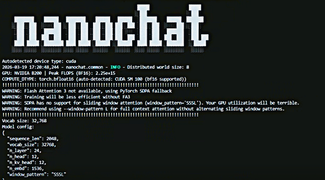
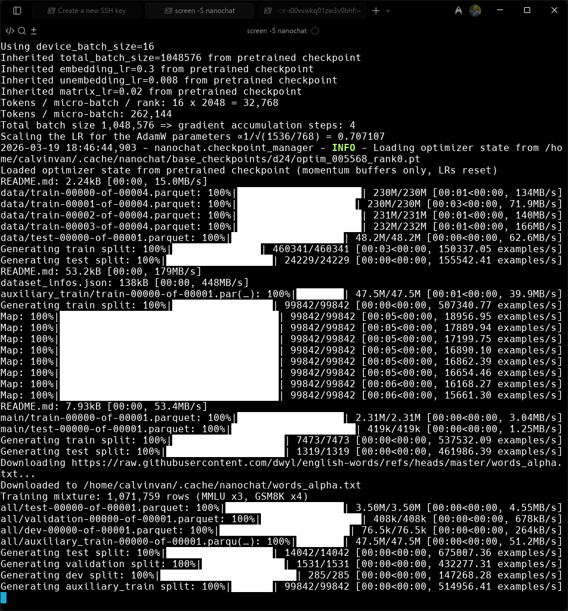
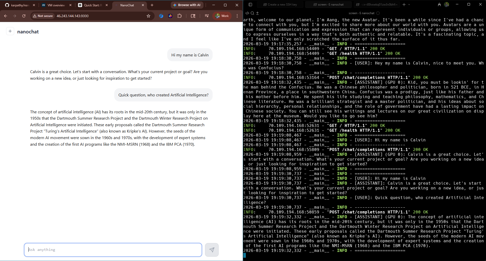

# Nanochat Training Run on Nebius

This repository captures a successful end to end Nanochat training run completed on Nebius using rented H200 GPUs. It includes the cleaned codebase used during the run, the final report, and a simple record of what was preserved after training. Nanochat is Andrej Karpathy’s educational LLM training project that walks through the full process of building, training, fine tuning, and serving a small chat model from scratch.

## What this repository contains

This repo is meant to hold the readable and reusable parts of the project:

Code used for the run

Final generated report

Documentation for what was trained, what was saved, and how the artifacts were organized afterward

The full model artifacts were backed up separately so this repository can stay clean and lightweight.

## Run overview

This run was completed on a Nebius GPU VM using the official Nanochat speedrun workflow. After training finished, I was able to launch the browser based chat UI successfully, confirm that the model loaded, and verify that the main checkpoint and tokenizer assets were preserved before shutting the machine down.

## Screenshots

### Nanochat

### Training run snapshot

### Browser chat UI

## Saved outputs

The most important outputs from the run were:

Chat fine tuned checkpoint directory: `chatsft_checkpoints/d24`

Final model weights: `model_000483.pt`

Metadata: `meta_000483.json`

Tokenizer assets:  
`tokenizer.pkl`  
`token_bytes.pt`

## Why this repo exists

I wanted this repository to be more than just a dump of files. It is a clean record of a real training run that worked from start to finish, including setup, execution, validation, browser testing, and backup. It also reflects the lessons learned from earlier attempts where the final save process did not go smoothly.

This version represents a much stronger outcome. The run completed, the outputs were verified, the tokenizer was preserved, and the key artifacts were backed up locally before the VM was shut down.

## Model artifacts

Large checkpoint files and tokenizer assets are stored separately from this code repository to keep the project lightweight and easier to navigate. This repository focuses on code, report files, and project context, while the trained weights and tokenizer assets are intended to be published in a Hugging Face model repository.